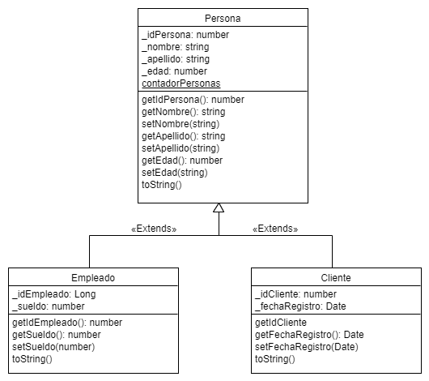

# **Ejercicio de herencia de la universidad Udemy**

---
#**Table of contents**

- [Configuración inicial](#configuración-inicial)

##*Configuración inicial*
1. Inicié terminal Git Bash
2. Creé la carpeta donde voy a guardar éste trabajo desde Git Bash 
3. Creé el repositortio en github
4. Conecté éste repositorio con mi terminal Git Bash
5. Abrí Visual Code desde mi terminal 
6. Creé los archivos del proyecto para iniciar el ejercicio
7. Les dí un nombre a cada archivo
8. Primer commit.
9. Ejercicio realizado
10. Segundo commit
11. Dí formato al ejercicio
12. Tercer commit
13. Agregue una carpeta de imagen
14. Agregue la imagen dentro de ésta carpera nueva
15. Último commit

---

#**Consignas del ejercicio**

1.##*Crear una clase padre*
- Crear una clase padre llamada Persona
- Agregar un static de contador a ésta clase
- Agregar atributos de "idPersona,nombre, apellido y edad"
- Agregar métodos get a éstos 4 atributos
- Agregar métodos set a los atributos de "nombre, apellido y edad"
- Concatenar todo con toString()

2.##*Crear una primer clase hija*
- Crear una clase hija llamada "Empleado" que herede de clase Persona
- Agregar un static de contador a ésta clase
- Heredar atributos de clase Persona
- Agregar atributos de "idEmpleado y sueldo"
- Agregar métodos get a éstos 2 atributos
- Agregar método set sólo al atributo sueldo.
- Concatenar todo con toString()

3.##*Crear una segunda clase hija*
- Crear una clase hija llamada "Cliente" que herede de clase Persona
- Agregar un static de contador a ésta clase
- Heredar atributos de clase Persona
- Agregar atributos de "idCliente y fecha de registro"
- Agregar métodos get a éstos 2 atributos
- Agregar método set sólo al atributo fecha de registro.
- Concatenar todo con toString()

4.##*Crear dos variables a cada clase*
-persona1 y persona2 a nuestra clase de Persona
-empleado1 y empleado2 a nuestra clase de Empleado
-cliente1 y cliente2 a nuestra clase de Cliente

5.##*Agregar valores a nuestras variables*

6.##*Imprimir nuestras variables en consola*
-Obtener el resultado de tostring() de cada una de nuestras clases

7.##*Dar formato*

###*Documentación del ejercicio*

